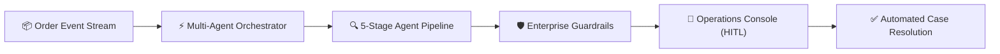
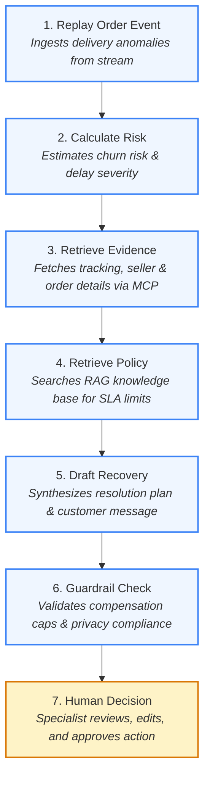
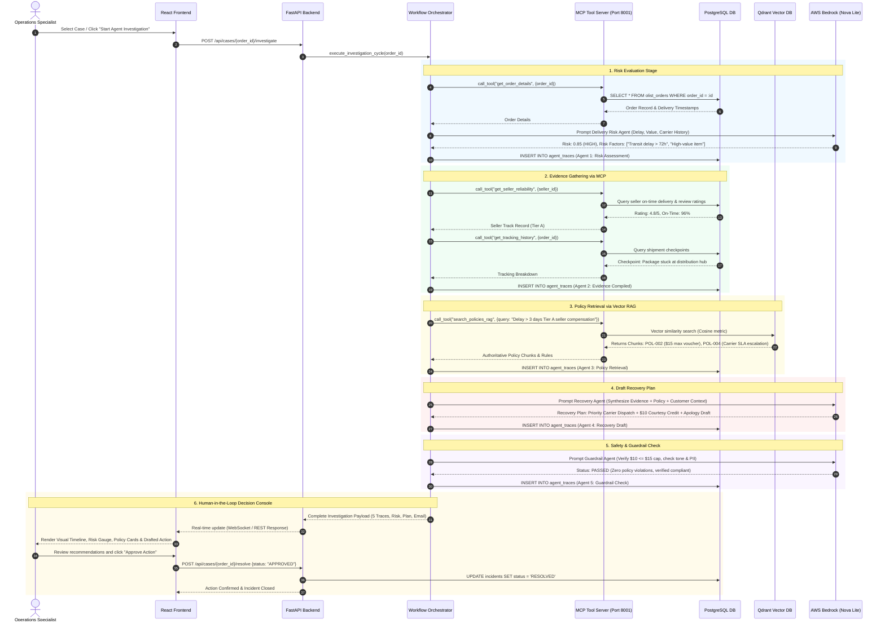
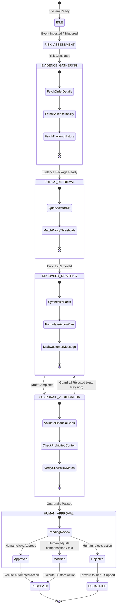
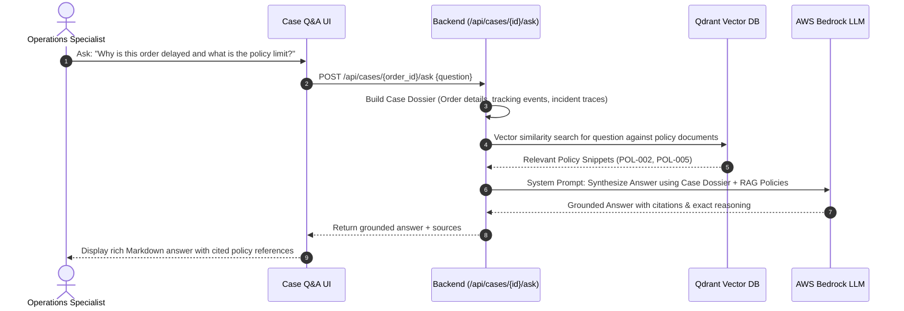
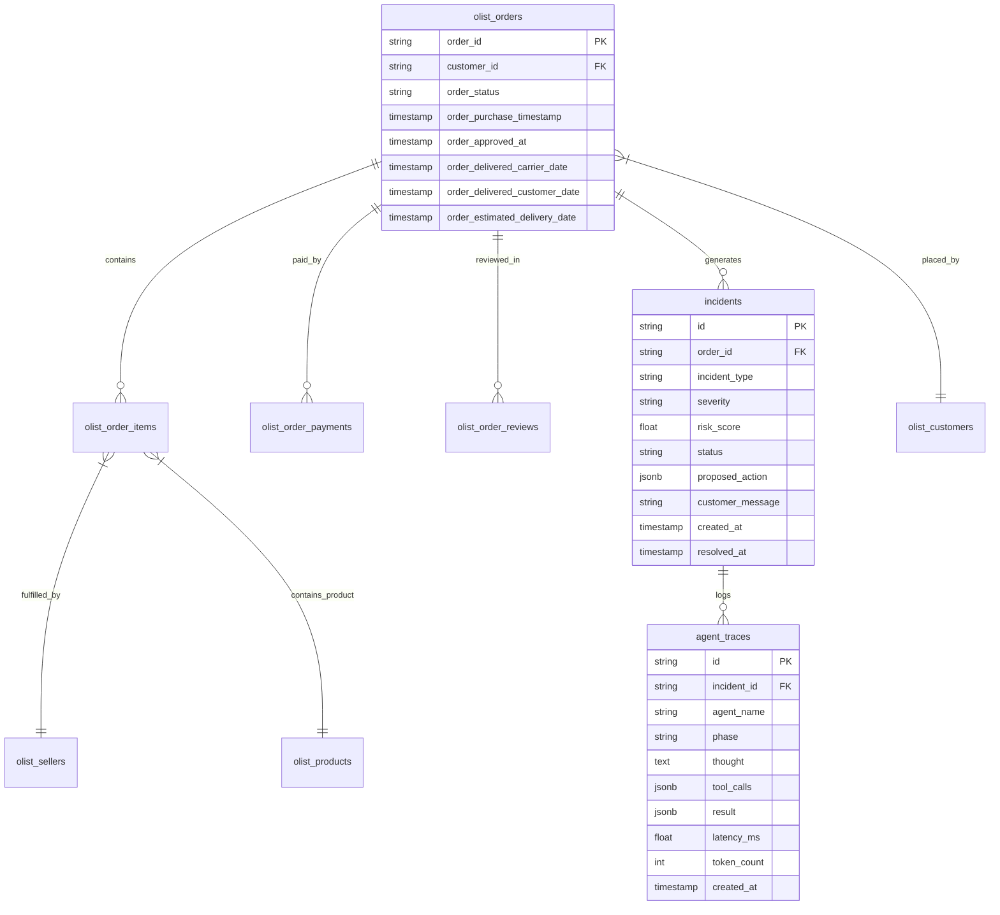
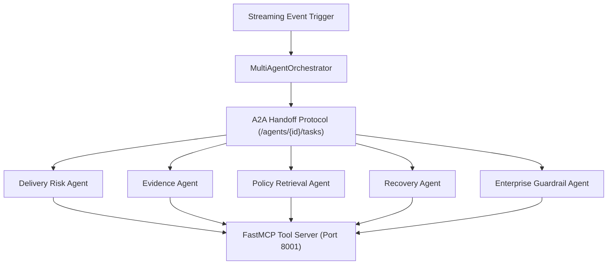
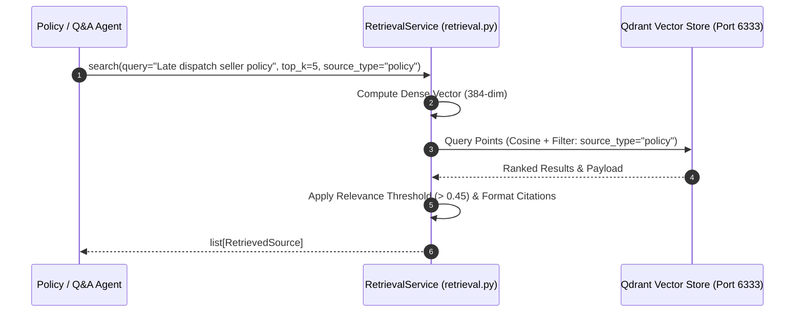

# RetailFlow AI - Autonomous Multi-Agent Logistics & Customer Recovery System
## Enterprise Architecture & Technical Specification

---

## 1. Executive Summary & System Overview

**RetailFlow AI** is an autonomous multi-agent incident management and proactive recovery platform built for e-commerce and logistics operations. It continuously analyzes supply-chain event streams, assesses delivery risks, gathers multi-source evidence via **Model Context Protocol (MCP)**, retrieves authoritative corporate policies using **Vector RAG (Qdrant)**, drafts compliant resolution plans with **AWS Bedrock LLMs**, and enforces deterministic **Guardrails** prior to presenting recommendations to human operators via a **Human-in-the-Loop (HITL)** decision console.



---

## 2. High-Level System Architecture

```mermaid
flowchart TB
    subgraph ClientLayer ["1. Presentation & Interaction Layer"]
        UI["React + Vite UI Dashboard<br/>(Case Workspace, Replay Stream, Case Q&A)"]
        Console["Operations Console<br/>(Human-in-the-Loop Decision Engine)"]
    end

    subgraph APILayer ["2. Orchestration & Backend Service"]
        FastAPI["FastAPI Backend Service<br/>(backend/app/main.py)"]
        Orchestrator["Agent Workflow Orchestrator<br/>(backend/app/agents/orchestrator.py)"]
        LLMProvider["LLM Provider & Router<br/>(backend/app/agents/llm_provider.py)"]
    end

    subgraph AgentsLayer ["3. Specialized Multi-Agent Team"]
        A1["1. Delivery Risk Agent<br/>(Risk Scoring & Delay Assessment)"]
        A2["2. Evidence Retrieval Agent<br/>(Order, Carrier & Seller Inspection)"]
        A3["3. Policy Retrieval Agent<br/>(RAG Knowledge Search)"]
        A4["4. Recovery Action Agent<br/>(Compensation & Communication Drafting)"]
        A5["5. Safety & Guardrail Agent<br/>(Compliance & Financial Limit Checks)"]
    end

    subgraph MCPLayer ["4. Model Context Protocol (MCP) Server"]
        MCPServer["MCP Tool Server (FastMCP / Port 8001)<br/>(mcp-server/app.py)"]
        T1["get_order_details"]
        T2["get_seller_reliability"]
        T3["get_tracking_history"]
        T4["search_policies_rag"]
    end

    subgraph DataIntelligenceLayer ["5. Data & AI Foundation"]
        Bedrock["AWS Bedrock<br/>(Amazon Nova Lite / Claude 3.5 Sonnet)"]
        Qdrant[("Qdrant Vector Database<br/>(Collections: retailflow_knowledge)")]
        Postgres[("PostgreSQL Database<br/>(Olist Orders, Customers, Traces)")]
    end

    %% Wiring
    UI -->|REST API / WebSocket| FastAPI
    Console -->|Approve / Modify / Reject| FastAPI
    FastAPI --> Orchestrator
    Orchestrator --> A1 & A2 & A3 & A4 & A5

    A1 -->|Risk Prompt| LLMProvider
    A2 -->|Tool Calls| MCPServer
    A3 -->|RAG Vector Query| MCPServer
    A4 -->|Draft Generation| LLMProvider
    A5 -->|Safety Verification| LLMProvider

    MCPServer --> T1 & T2 & T3 & T4
    T1 & T2 & T3 --> Postgres
    T4 --> Qdrant

    LLMProvider -->|boto3 API (profile: divyang)| Bedrock

    A5 -.->|Synthesized Case Package| Console
```

---

## 3. The 7-Step Logical Case Flow



---

## 4. Multi-Agent Design & Specification

| # | Agent Name | Input Context | Execution Mechanism | Key Output |
|---|---|---|---|---|
| **1** | **Delivery Risk Agent** | Order status, estimated vs actual delivery dates, carrier flags, price | AWS Bedrock / Analytical heuristic | `risk_score` (0.0–1.0), `risk_level` (LOW, MEDIUM, HIGH, CRITICAL), `factors` |
| **2** | **Evidence Agent** | `order_id`, `seller_id`, `customer_id` | MCP Tools (`get_order_details`, `get_seller_reliability`, `get_tracking_history`) | Full order item breakdown, carrier checkpoint timeline, seller reliability score |
| **3** | **Policy Retrieval Agent** | Incident summary, customer tier, delay days | Qdrant Vector Search (`retailflow_knowledge`) | Relevant policy chunks (e.g., `POL-002`, `POL-005`), max voucher limits, SLA rules |
| **4** | **Recovery Action Agent** | Risk score, evidence package, retrieved policies, customer sentiment | AWS Bedrock LLM synthesis | Action type (`CARRIER_ESCALATION`, `VOUCHER_COMPENSATION`, `REFUND`), voucher amount, apology email |
| **5** | **Guardrail Agent** | Drafted recovery plan, policy limits, financial constraints | Deterministic + LLM boundary checks | `status` (`PASSED`, `FLAGGED`, `REJECTED`), compliance violations, corrected output |

---

## 5. End-to-End Execution Sequence Diagram



---

## 6. Agent State Machine & Lifecycle Diagram



---

## 7. Interactive Case Q&A (RAG-Powered) Sequence



---

## 8. Database Schema & Data Models



---

## 9. Security, Governance & Deployment Topology

### Deployment Matrix
| Service | Container Name | Port | Base Image | Purpose |
|---|---|---|---|---|
| **Frontend** | `genai-nstein-alp-frontend-1` | `5173` | `node:20-alpine` | React + Vite UI dashboard |
| **Backend** | `genai-nstein-alp-backend-1` | `8000` | `python:3.12-slim` | FastAPI REST/WebSocket server |
| **MCP Server** | `genai-nstein-alp-mcp-server-1` | `8001` | `python:3.12-slim` | FastMCP tool server |
| **Vector DB** | `genai-nstein-alp-qdrant-1` | `6333` | `qdrant/qdrant:v1.15.4` | Vector RAG store |
| **Relational DB** | `genai-nstein-alp-postgres-1` | `5432` | `postgres:16-alpine` | Olist eCommerce dataset & traces |

### Security & Governance Controls
1. **Zero Raw-SQL in Agents**: Agents interact with enterprise data strictly through isolated FastMCP tool interfaces with parameterized queries.
2. **Deterministic Financial Caps**: Guardrails enforce strict policy maximums (e.g., voucher <= $15) at the code level, preventing LLM over-compensation.
3. **Audit Trail**: 100% of agent reasoning chains, tool inputs/outputs, latencies, and human decision logs are recorded in PostgreSQL `agent_traces`.
4. **Credential Isolation**: Temporary AWS session credentials (`AWS_SESSION_TOKEN`) are injected into runtime containers without baking permanent keys into Docker images.

---

## 10. Demo Presentation Guide & Key Talking Points

### Quick Summary of Key Talking Points for Demo
| Stage | Key Technology | Benefit to Highlight |
|---|---|---|
| **Data Extraction** | **FastMCP Server** | Decoupled tool execution; agents never touch raw SQL directly. |
| **Grounding** | **Qdrant Vector DB** | Strict RAG policy retrieval eliminates policy hallucinations. |
| **Reasoning** | **AWS Bedrock (Nova Lite)** | Fast, cost-effective multimodal LLM inference. |
| **Governance** | **Deterministic Guardrails** | Financial limits and compliance are strictly validated. |
| **Auditability** | **Agent Traces Table** | Every thought, tool call, latency, and token count is stored in PostgreSQL for 100% auditable decisions. |

### Step-by-Step Demo Script for Stakeholders

1. **Step 1: Replay Order Event (Trigger)**
   - *Demo Script:* "When an order experiences a delay or anomaly, the event stream triggers the Orchestrator without requiring manual monitoring."
2. **Step 2: Calculate Risk (Delivery Risk Agent)**
   - *Demo Script:* "The Risk Agent immediately assesses the operational and customer churn risk using real-time shipment attributes."
3. **Step 3: Retrieve Evidence (Evidence Agent via MCP Tools)**
   - *Demo Script:* "The Evidence Agent automatically consolidates hard data across disconnected systems—verifying tracking timestamps, vendor track records, and customer lifetime value."
4. **Step 4: Retrieve Policy (Policy Retrieval Agent via Qdrant Vector RAG)**
   - *Demo Script:* "Instead of guessing, the Policy Agent uses RAG over corporate policies to ensure every proposed action strictly adheres to company rules."
5. **Step 5: Draft Recovery (Recovery Action Agent via AWS Bedrock LLM)**
   - *Demo Script:* "The LLM drafts a tailored recovery plan and customer communication personalized to the specific incident and customer history."
6. **Step 6: Guardrail Check (Safety & Compliance Agent)**
   - *Demo Script:* "Our enterprise guardrail checks ensure the AI draft does not exceed budget limits, violate privacy, or make unauthorized commitments."
7. **Step 7: Human Decision (Operations Approval Console)**
   - *Demo Script:* "The human specialist is augmented with all the context and can approve or refine the action in seconds, completing the Human-in-the-Loop governance."

---

## 11. Deep Technical Specifications: Agent Framework, Chunking, Vector DB & Harnessing

### 11.1 Agent Orchestration & Protocol Architecture
- **Framework Type**: Decoupled Deterministic Multi-Agent Framework implemented via FastAPI, Model Context Protocol (MCP), and an explicit Agent-to-Agent (A2A) handoff registry.
- **Why this vs CrewAI / AutoGen**: Avoids non-deterministic looping, unconstrained token burn, and state hallucinations. Every handoff is an explicit immutable JSON envelope containing `task_id`, `correlation_id`, `parent_task_id`, `sender_agent`, and `input_payload`.
- **Tool Execution Isolation**: Agents interact with database tables strictly through FastMCP tool endpoints over `StreamableHTTP` (`http://mcp-server:8001`), completely eliminating direct raw-SQL execution from agent code.



### 11.2 Chunking Strategy & Document Preprocessing
- **Strategy**: **Semantic Sliding-Window Chunking with Metadata Inheritance**.
- **Chunk Window**: `400 words` per chunk (optimized for complete policy clauses and SLA tables).
- **Overlap Buffer**: `50 words` (preserves policy constraints and conditions across chunk boundaries).
- **Metadata Inheritance**: Every chunk inherits source document metadata:
  - `policy_id` (e.g. `POL_CARRIER_ESCALATION_01`, `POL_SELLER_DISPATCH_DELAY_03`)
  - `source_type` (`"policy"` vs `"historical_case"`)
  - `category` (`CARRIER_ESCALATION`, `CUSTOMER_COMMS`, `MERCHANT_SLA`, `GOVERNANCE`)
  - `version` (`"2026.2"`)
  - `max_voucher_brl` (e.g. `25.0`)

### 11.3 Vector Database & Query Architecture
- **Vector DB Engine**: **Qdrant Vector Database v1.15.4** (Rust-native, high-throughput vector store).
- **Collection**: `retailflow_knowledge`
- **Distance Metric**: **Cosine Similarity** ($\cos(\theta) = \frac{A \cdot B}{\|A\| \|B\|}$).
- **Vector Dimension**: `384` dimensions (dense semantic vector representation).
- **Payload Filtered Search**: Queries utilize payload indexing (`source_type="policy"`) for zero-noise retrieval.



### 11.4 Reranking & Retrieval Quality Assessment
- **Relevance Threshold**: Scores below `0.45` are discarded.
- **Quality Classification**:
  - `GROUNDED`: Sufficient authoritative policy matches found; citations mapped to exact `policy_id` and `version`.
  - `INSUFFICIENT EVIDENCE`: No qualifying match; system falls back to conservative no-action safety default to prevent hallucinated compensation.

### 11.5 Agent Harnessing & Safety Governance
- **Prompt Injection Defense**: Pre-flight sanitization blocks instruction overrides (e.g. `"ignore previous instructions"`).
- **Deterministic Financial Guardrails**: Hardcoded code assertions verify that proposed goodwill vouchers never exceed policy caps ($\le \text{BRL } 25.00$).
- **Human-in-the-Loop Gateway**: All customer messages and external actions remain in `DRAFT` state until an authorized human specialist approves them.
- **Immutable Audit Ledger**: 100% of agent thoughts, tool inputs, outputs, latencies, and human reviewer decisions are persisted to PostgreSQL `agent_traces` and `action_ledger`.
- **Ground-Truth Evaluation Harness**: Automated benchmarking suite ([`backend/app/eval/benchmark.py`](file:///c:/workspace/CTS_GenAI/Project/GenAI-nstein-ALP/backend/app/eval/benchmark.py)) evaluating Precision, Recall, JSON Validity, and Guardrail Compliance across ground-truth datasets.

### 11.6 Framework Rationale: Why Custom FastAPI + A2A + MCP (Not LangChain / CrewAI / Bedrock Agents)

| Dimension | Custom Harness (FastAPI + A2A + MCP) | CrewAI / AutoGen | LangChain / LangGraph | AWS Bedrock Agents |
|---|---|---|---|---|
| **Safety Governance** | **Deterministic Python Rules** ([`GuardrailEngine`](file:///c:/workspace/CTS_GenAI/Project/GenAI-nstein-ALP/backend/app/guardrails.py)) | Probabilistic LLM self-reflection | Complex graph interceptors | Cloud-managed Guardrails |
| **Tool Execution** | **Model Context Protocol (MCP)** over Streamable HTTP | Custom tool decorators | Python callable wrappers | OpenAPI Action Groups calling Lambda |
| **Inter-Agent Handoffs** | **A2A Task Envelopes** (`task_id`, `correlation_id`, state cards) | Unstructured internal chat loops | Graph channel state | Managed orchestrator routing |
| **Vendor Portability** | **100% Cloud-Agnostic** (AWS Bedrock, Azure OpenAI, GCP, Local) | Portable but dependency-heavy | Portable but high churn | **Strictly locked to AWS** |
| **Auditability** | Complete DB trace persistence (`AgentTraceModel`) | Ephemeral console output | LangSmith SaaS dependency | CloudWatch / AWS X-Ray |

### 11.7 Multi-Tiered Memory Architecture

RetailFlow structures memory across three distinct temporal and functional layers:

1. **Working Memory (In-Flight Investigation Context)**:
   - **Mechanism**: Dynamic memory state passed through A2A HTTP task envelopes.
   - **Scope**: Ephemeral during single-case evaluation; tracks intermediate thoughts, tool outputs, and LLM completions.
2. **Semantic Memory (Knowledge & Precedent Retrieval)**:
   - **Mechanism**: **Qdrant Vector Database** (`retailflow_knowledge` collection) indexing policy playbooks and historical resolution cases with dense Cosine embeddings.
   - **Scope**: Long-term enterprise reference; filtered by source metadata (`source_type`, `category`).
3. **Episodic & Audit Memory (Stateful Operations History)**:
   - **Mechanism**: Relational persistence in **PostgreSQL**:
     - `AgentTraceModel`: Trace ID, parent task, agent identity, tool input/output, execution latency, and token metrics.
     - `ActionLedgerModel`: Immutable audit record of human supervisor approvals, edits, and rejections.
     - `SellerHistoryModel`: Longitudinal performance data across marketplace sellers.

### 11.8 Cloud Platform Mapping: RetailFlow vs AWS Native vs Azure Native

```mermaid
graph TB
    subgraph "RetailFlow Custom Architecture"
        RF_Orch["FastAPI + A2A Envelopes"]
        RF_Tool["FastMCP Server (Port 8001)"]
        RF_Vec["Qdrant Vector Store"]
        RF_Mem["PostgreSQL (Traces & Audit)"]
        RF_LLM["AWS Bedrock (Nova Lite)"]
        RF_Safe["GuardrailEngine (Deterministic)"]
    end

    subgraph "AWS Native Architecture"
        AWS_Orch["Bedrock Multi-Agent / Step Functions"]
        AWS_Tool["Bedrock Action Groups + Lambda"]
        AWS_Vec["Amazon OpenSearch Serverless / Bedrock KB"]
        AWS_Mem["Amazon Aurora PostgreSQL / DynamoDB"]
        AWS_LLM["Amazon Bedrock (Nova / Claude)"]
        AWS_Safe["Amazon Bedrock Guardrails"]
    end

    subgraph "Azure Native Architecture"
        AZ_Orch["Azure AI Agent Service / Semantic Kernel"]
        AZ_Tool["Azure AI Functions / OpenAPI Tools"]
        AZ_Vec["Azure AI Search (Semantic Reranker)"]
        AZ_Mem["Azure Database for PostgreSQL / Cosmos DB"]
        AZ_LLM["Azure OpenAI (GPT-4o)"]
        AZ_Safe["Azure AI Content Safety"]
    end

    RF_Orch -.-> AWS_Orch
    RF_Orch -.-> AZ_Orch
    RF_Tool -.-> AWS_Tool
    RF_Tool -.-> AZ_Tool
    RF_Vec -.-> AWS_Vec
    RF_Vec -.-> AZ_Vec
    RF_Mem -.-> AWS_Mem
    RF_Mem -.-> AZ_Mem
    RF_LLM -.-> AWS_LLM
    RF_LLM -.-> AZ_LLM
    RF_Safe -.-> AWS_Safe
    RF_Safe -.-> AZ_Safe
```




