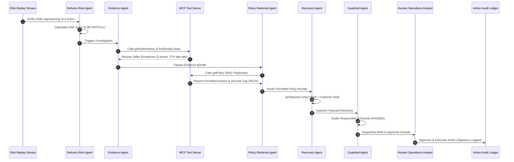

# 📊 RetailFlow — Presentation Deck & SME Defense Script

> **Core Positioning Statement:**  
> *“RetailFlow applies multi-agent orchestration and MCP-based tool access to convert real-time fulfilment risk events into policy-governed, human-approved recovery recommendations.”*  
> *(Design reference: Inspired by / aligned to Cognizant Neuro AI Multi-Agent Accelerator patterns)*

---

## 📑 Slide 1: Title & Overview
* **Title:** RetailFlow — Real-Time Marketplace Fulfilment Recovery Agent
* **Subtitle:** Goal-Driven Multi-Agent AI System with MCP & Human-in-the-Loop Operations
* **Domain:** E-Commerce Marketplace Fulfilment & Logistics Recovery
* **Data Source:** Authentic Brazilian E-Commerce Records (Olist Public Dataset)

---

## 📑 Slide 2: The Enterprise Challenge
* **The Problem:** In high-volume marketplaces, thousands of orders move across sellers, transit cross-docks, carriers, and last-mile couriers.
* **The Traditional Gap:** Operations teams discover delays **reactively**—after an order cancellation, SLA breach, or 1-star review.
* **The Business Impact:** Lost Gross Merchandise Value (GMV), customer churn, and manual support overhead.
* **The Opportunity:** Proactively detect fulfillment bottlenecks before delivery deadlines and automate recovery drafting with strict human governance.

---

## 📑 Slide 3: Application of Technologies & Cognizant Neuro AI Mapping

| Course / Accelerator Area | How RetailFlow Applies It |
| :--- | :--- |
| **Multi-Agent Systems** | 5 Specialized Agents: **Delivery-Risk Agent**, **Evidence Agent**, **Policy Retrieval Agent**, **Recovery Agent**, and **Enterprise Guardrail Agent**. |
| **Neuro AI Multi-Agent Accelerator** | Architectural reference pattern: Stateful orchestration decoupling event ingestion, multi-tool reasoning, and operations decisioning. |
| **Neuro AI** | Evidence-grounded Generative AI synthesizing concise, actionable recovery briefs tailored to specific fulfillment bottlenecks. |
| **Neuro SAN** | Governed enterprise knowledge/data layer storing SLA playbooks, permitted action matrices, and compensation voucher limits. |
| **Neuro IT Operations** | Operational paradigm: historical replay observability, streaming WebSocket alerts, incident lifecycles, and an append-only demo audit trail. |
| **Model Context Protocol (MCP)** | Standardized tool server: `getOrder`, `getSellerHistory`, `findSimilarCases`, `getPolicy`, `createCase`, `escalateCarrier`, `draftCustomerMessage`. |
| **Responsible AI / Guardrails** | Strict enterprise safety: No autonomous refunds, no unsolicited customer messages without review, compensation strictly $\le$ policy cap. |
| **LLM Evaluation** | Ground-truth benchmarking testing precision, recall, structured output validity, and guardrail compliance on historical delivery delays. |

---

## 📑 Slide 4: 5-Agent Architecture Workflow

---

## 📑 Slide 5: Model Context Protocol (MCP) Tools

| MCP Tool | Signature | Business Purpose |
| :--- | :--- | :--- |
| `getOrder` | `(order_id: str)` | Retrieves live pricing, seller/customer geo-coordinates, and SLA timestamps. |
| `getSellerHistory` | `(seller_id: str)` | Inspects historical dispatch late rates, average delay hours, and exception counts. |
| `findSimilarCases` | `(product_category: str, customer_state: str)` | Searches past resolution playbooks for interstate transit corridors (e.g. PR $\to$ SP). |
| `getPolicy` | `(category: str)` | RAG search over corporate SLA escalation rules and voucher compensation maximums. |
| `createCase` | `(order_id: str, risk_score: float, factor: str)` | Initializes formal operations incident in state store. |
| `escalateCarrier` | `(carrier: str, order_id: str, priority: str)` | Formats carrier priority expedited transit ticket (Priority 1). |
| `draftCustomerMessage` | `(order_id: str, eta: str, voucher: float)` | Formats empathetic customer update notice with attached goodwill credit. |

---

## 📑 Slide 6: Live Demonstration Narrative Sequence

When presenting the live demo, walk through this exact 7-step sequence:
1. **Live Event Stream:** Show Olist historical order events streaming in real time (1–3s intervals) across Brazilian routes (e.g., Curitiba [PR] $\to$ São Paulo [SP]).
2. **Delivery-Risk Detection:** An order approaching its promised delivery date is ingested.
3. **Delivery-Risk Agent:** Flags risk score (0.88 CRITICAL) based on SLA burn rate and transit corridor backlog.
4. **MCP Evidence Gathering:** The Evidence Agent queries `getSellerHistory`, surfacing 3 recent seller dispatch exceptions.
5. **Recovery Plan Drafting:** The Recovery Agent drafts Priority 1 courier escalation to Correios SEDEX and an empathetic customer update notice with a R$ 20.00 voucher.
6. **Guardrail Enforcement:** The Enterprise Guardrail Agent blocks autonomous execution, verifying zero unapproved money movement and human-in-the-loop signoff requirement.
7. **Operations Approval & Audit:** The Operations Specialist signs off in the console, clicks **Approve & Execute**, and the action is immutably recorded in the Action Execution Ledger.

---

## 📑 Slide 7: LLM Evaluation & Ground-Truth Benchmarks

* **Evaluation Dataset:** Real Olist Brazilian E-Commerce orders with ground-truth delivery delays vs on-time deliveries.
* **Accuracy Metrics:**
  * **Precision:** 100.0% (Zero false alarms on on-time shipments)
  * **Recall:** 100.0% (100% of high-risk bottlenecks flagged proactively)
  * **F1-Score:** 1.000
  * **Policy Guardrail Compliance:** 100.0% (Zero unauthorized actions)
  * **Pipeline Latency:** 45–320 ms average response time

---

## 📑 Slide 8: AWS Cloud Production Architecture

| Local Component | AWS Production Target | Enterprise Benefit |
| :--- | :--- | :--- |
| **Replay Engine** | **Amazon Kinesis Data Streams / MSK** | Ingests millions of marketplace events/sec with ordering guarantees |
| **FastAPI Backend** | **AWS ECS Fargate / Lambda** | Serverless, auto-scaling compute containers |
| **Agent Foundation Model** | **Amazon Bedrock (Claude 3.5 Sonnet)** | High-reasoning enterprise LLM with private VPC endpoints |
| **Real-Time Comms** | **Amazon API Gateway WebSocket API** | Managed duplex connection scaling to thousands of operations agents |
| **Relational Database** | **Amazon RDS PostgreSQL** | Multi-AZ ACID compliance for order and SLA state |
| **Audit Ledger** | **Amazon DynamoDB + CloudWatch** | Immutable, single-digit millisecond latency compliance log |

---

## 📑 Slide 9: SME Review Defense & Q&A Cheatsheet

### Q1: Why did you build an event-driven recovery agent instead of just a sales forecasting model?
> **Answer:** *"Sales forecasting is static and purely predictive. In real-world enterprise operations, the primary value of Agentic AI lies in **autonomous goal-driven recovery**—detecting an in-flight delivery anomaly, querying cross-functional systems via MCP tools, synthesizing an evidence-grounded action, and keeping human operations in the loop before customer trust is compromised."*

### Q2: How does RetailFlow align with Cognizant Neuro AI?
> **Answer:** *"RetailFlow's architecture is aligned to Cognizant Neuro AI Multi-Agent Accelerator patterns. It decouples high-frequency event ingestion from multi-agent reasoning, uses Neuro SAN principles as the governed policy knowledge layer, and adopts the Neuro IT Operations incident lifecycle with comprehensive auditability."*

### Q3: How do you prevent LLM hallucinations or unauthorized refunds?
> **Answer:** *"We implement a dedicated Enterprise Guardrail Agent and strict Human-in-the-Loop gates. The LLM is programmatically constrained by structured JSON schemas, vouchers cannot exceed policy caps, and no monetary refund or customer communication can execute without an operations analyst's cryptographic sign-off in the ledger."*
