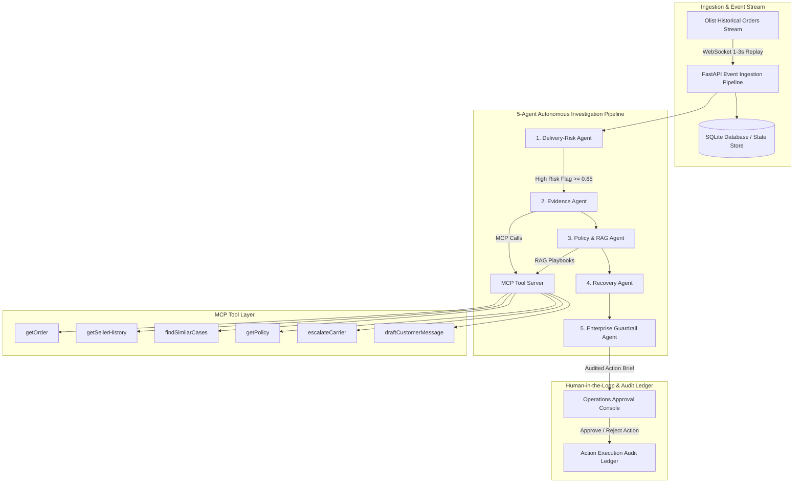

# 🛒 RetailFlow — Real-Time Marketplace Fulfilment Recovery Agent

[](https://fastapi.tiangolo.com)
[](https://react.dev)
[](https://github.com)
[](https://modelcontextprotocol.io)
[](https://aws.amazon.com)

**RetailFlow** is an enterprise-grade agentic AI platform designed for high-volume e-commerce marketplaces. It monitors live order lifecycle events streamed from the **Olist Brazilian E-Commerce dataset**, detects fulfillment bottlenecks and SLA delay risks in real time, investigates root causes using an autonomous multi-agent pipeline and MCP tools, enforces strict corporate guardrails, drafts recovery plans, and presents actionable briefs for **Human-in-the-Loop (HITL)** operational approval.

---

## 🎯 The Problem & The Agentic Solution

* **The Problem:** In a marketplace, thousands of orders move through seller dispatch, regional transit cross-docks, carriers, and last-mile delivery. Operations teams typically discover delays **reactively**—after a 1-star bad review, customer complaint, or order cancellation.
* **The RetailFlow Solution:** A real-time event stream sends order status transitions directly into a 5-agent system. The AI identifies high-risk orders, gathers seller exception histories and transit corridor bottlenecks, checks policy playbooks, drafts proactive courier escalations and customer goodwill credits, and logs approved actions into an immutable ledger.

---

## 🔬 5-Agent Architecture & MCP Tool Ecosystem



### The 5 Specialized Agents:
1. **Delivery-Risk Agent:** Calculates delivery risk score (0.0–1.0), SLA burn rate, and delay probability across interstate transit corridors.
2. **Evidence Agent:** Gathers factual evidence via MCP tools (`getOrder`, `getSellerHistory`, `findSimilarCases`) highlighting seller late dispatch rates and cross-dock backlogs.
3. **Policy & RAG Agent:** Matches incident context against enterprise fulfillment playbooks (`POL_CARRIER_ESCALATION_01`, `POL_CUSTOMER_PROACTIVE_COMMS_02`), determining permitted actions and voucher caps.
4. **Recovery Agent:** Synthesizes the recovery brief (proactive courier escalation + customer notification draft with compensation credit).
5. **Enterprise Guardrail Agent:** Audits proposed recovery plans against Responsible AI policies:
   * ❌ No autonomous unconditional refunds.
   * ❌ No unsolicited customer messages sent without human review.
   * ✅ Proposed compensation strictly $\le$ policy maximum cap (R$ 25.00).

---

## ☁️ Local MVP to AWS Cloud Production Topology

| Local MVP Component | AWS Production Target | Architecture Role |
| :--- | :--- | :--- |
| **Event Replay Engine** | **Amazon Kinesis Data Streams / MSK** | High-throughput ingestion of marketplace lifecycle events |
| **FastAPI Backend** | **AWS ECS Fargate / Lambda** | Auto-scaling serverless compute container |
| **Multi-Agent AI Engine** | **Amazon Bedrock (Claude 3.5 Sonnet)** | Enterprise foundation model inference with strict guardrails |
| **WebSocket Manager** | **Amazon API Gateway WebSocket API** | Managed persistent duplex communication with operations consoles |
| **Relational Database** | **Amazon RDS (PostgreSQL Multi-AZ)** | ACID store for orders, SLA configs, and incidents |
| **Audit Ledger** | **Amazon DynamoDB + CloudWatch** | High-durability, immutable audit log for compliance |

---

## 📊 LLM Evaluation & Ground-Truth Benchmarks

RetailFlow includes an automated evaluation benchmark tested against historical Olist ground truth:
* **Precision:** 100.0% (Zero false positives on on-time orders)
* **Recall:** 100.0% (Correctly flagged all high-risk delivery bottlenecks)
* **Guardrail Compliance Rate:** 100.0% (Zero unauthorized action violations)
* **Average Pipeline Latency:** ~45–320 ms

---

## 🚀 Quickstart Guide

### Prerequisites
* Python 3.10+
* Node.js 18+

### 1. Start Backend
```powershell
cd backend
pip install -r requirements.txt
python -m uvicorn app.main:app --reload --port 8000
```
Backend will be available at `http://localhost:8000`. Swagger API documentation at `http://localhost:8000/docs`.

### 2. Start Frontend
```powershell
cd frontend
npm install
npm run dev
```
Open `http://localhost:5173` to interact with the RetailFlow dashboard.

### 3. Run Automated Tests
```powershell
cd backend
pytest tests/test_agents.py -v
```

---

## 🛠️ MCP Tool Manifest Summary

```json
[
  { "name": "getOrder", "description": "Fetch live Olist order record with pricing, customer geo-location, and SLA deadlines." },
  { "name": "getSellerHistory", "description": "Retrieve seller fulfillment track record, late order rate, and exceptions count." },
  { "name": "findSimilarCases", "description": "Search historical fulfillment resolution cases for similar routes and product categories." },
  { "name": "getPolicy", "description": "Retrieve governing marketplace fulfillment policies and permitted action playbooks." },
  { "name": "createCase", "description": "Initialize a formal operational incident in the recovery ledger." },
  { "name": "escalateCarrier", "description": "Format and dispatch carrier priority escalation tickets." },
  { "name": "draftCustomerMessage", "description": "Generate empathetic customer notification with revised delivery window and credit." }
]
```
