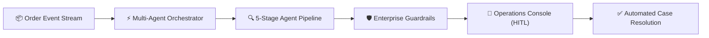
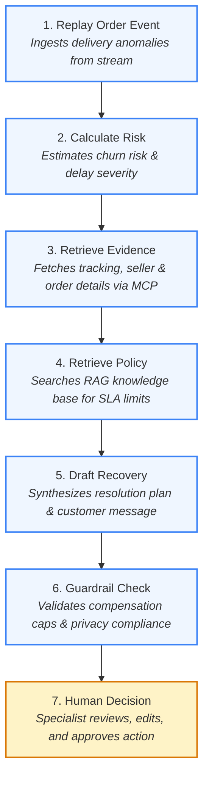
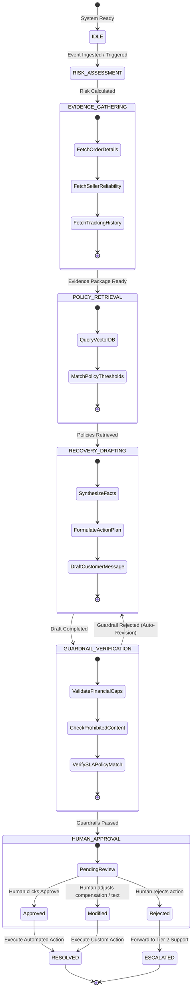
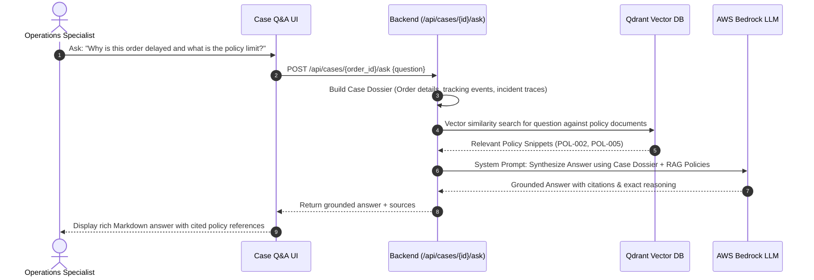
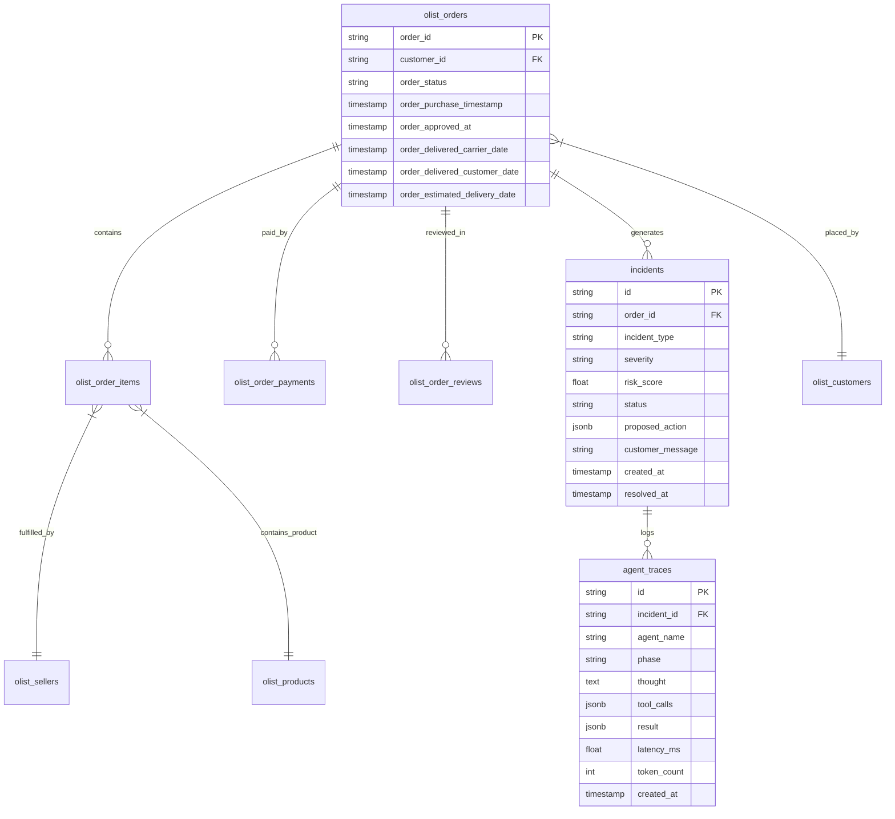
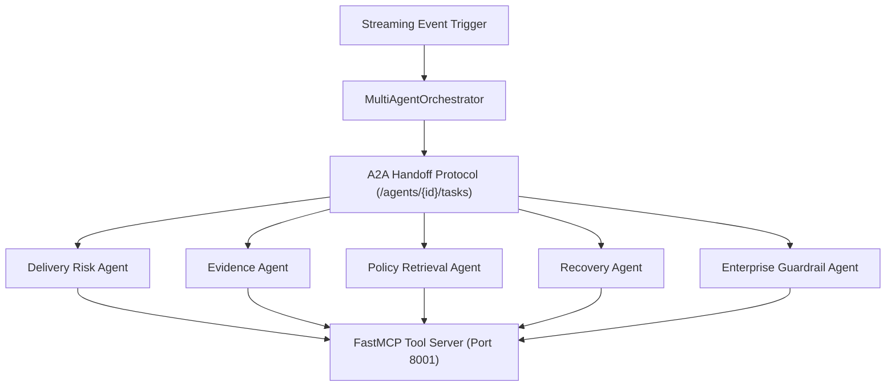
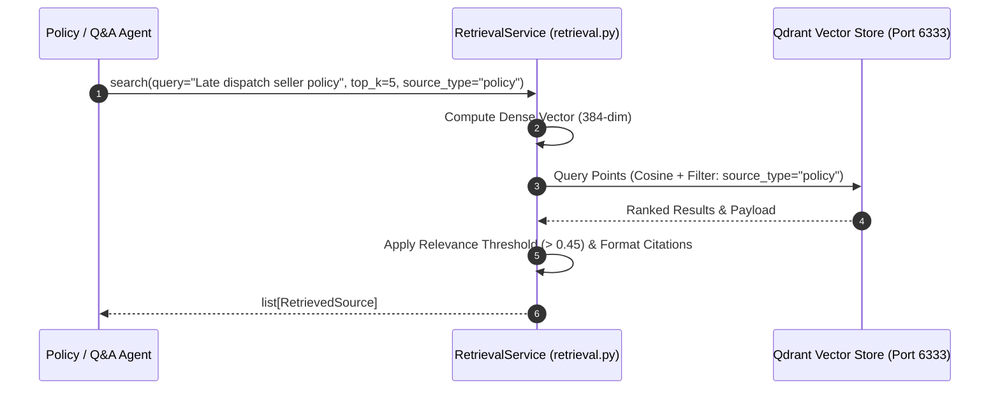

# RetailFlow AI - Autonomous Multi-Agent Logistics & Customer Recovery System
## Enterprise Architecture & Technical Specification

---

## 1. Executive Summary & System Overview

**RetailFlow AI** is an autonomous multi-agent incident management and proactive recovery platform built for e-commerce and logistics operations. It continuously analyzes supply-chain event streams, assesses delivery risks, gathers multi-source evidence via **Model Context Protocol (MCP)**, retrieves authoritative corporate policies using **Vector RAG (Qdrant)**, drafts compliant resolution plans with **AWS Bedrock LLMs**, and enforces deterministic **Guardrails** prior to presenting recommendations to human operators via a **Human-in-the-Loop (HITL)** decision console.



---

## 2. System Component & MCP Integration Architecture

```mermaid
graph TB 
    subgraph Frontend_Client ["Frontend Client: Operations Control Tower (React 19 + Vite)"] 
        UI_Header["Header & Replay Toolbar<br/>(Speed, Pause, Bedrock Status)"] 
        UI_Ribbon["Metrics Ribbon<br/>(At-Risk Orders, Value Protected)"] 
        UI_Queue["Live Risk Work Queue<br/>(Priority Ranked SLA Items)"] 
        UI_Workspace["Case Workspace & HITL Console<br/>(Action Brief, Decision Buttons)"] 
        UI_Inspector["Agent Trace Inspector<br/>(Thoughts, MCP Tool I/O, Latency)"] 
        UI_Modals["Architecture & Evaluation Modals<br/>(AWS Topology, Ground Truth Test)"] 
    end 
 
    subgraph API_Gateway_Layer ["FastAPI Ingestion & Web Server"] 
        Router_HTTP["REST API Endpoints<br/>(/api/orders, /api/incidents, /api/metrics)"] 
        WS_Manager["WebSocket Manager (/ws)<br/>(Real-Time Event Broadcast)"] 
        Engine_Replay["Replay Engine<br/>(Olist Brazilian Dataset Stream)"] 
    end 
 
    subgraph Agentic_Orchestration ["Autonomous Multi-Agent Investigation Engine"] 
        Orchestrator["MultiAgentOrchestrator<br/>(State Coordination & Idempotency)"] 
        Agent_Risk["1. Delivery-Risk Agent<br/>(SLA Burn Rate & Risk Heuristic)"] 
        Agent_Evidence["2. Evidence Agent<br/>(Root-Cause Correlation)"] 
        Agent_Policy["3. Policy & RAG Agent<br/>(Playbook Rule Grounding)"] 
        Agent_Recovery["4. Recovery Agent<br/>(Brief & Draft Synthesis)"] 
        Agent_Guardrail["5. Enterprise Guardrail Agent<br/>(Safety & Boundary Enforcement)"] 
    end 
 
    subgraph Tool_Protocol ["Model Context Protocol (MCP) Tool Server"] 
        MCP_Exec["MCPToolExecutor"] 
        T_Order["getOrder()"] 
        T_Seller["getSellerHistory()"] 
        T_Cases["findSimilarCases()"] 
        T_Policy["getPolicy()"] 
        T_CaseCreate["createCase()"] 
        T_Carrier["escalateCarrier()"] 
        T_Comms["draftCustomerMessage()"] 
    end 
 
    subgraph Foundation_Models ["Inference Gateway"] 
        LLM_Provider["LLMProvider Router"] 
        Bedrock["Amazon Bedrock Runtime<br/>(us.amazon.nova-lite-v1:0 / nova-pro)"] 
        Fallback["Deterministic Safe Fallback<br/>(Circuit Breaker Mode)"] 
    end 
 
    subgraph Data_Storage ["Data Tier & Audit Store"] 
        DB_Orders[("Orders Store<br/>OrderModel")] 
        DB_Sellers[("Seller History<br/>SellerHistoryModel")] 
        DB_Policies[("Policy Playbooks<br/>PolicyPlaybookModel")] 
        DB_Incidents[("Incidents Ledger<br/>IncidentModel")] 
        DB_Traces[("Agent Execution Traces<br/>AgentTraceModel")] 
        DB_Ledger[("Immutable Audit Ledger<br/>ActionLedgerModel")] 
    end 
 
    %% Connections 
    Frontend_Client <==>|Duplex WebSockets & REST| API_Gateway_Layer 
    Engine_Replay -->|Stream Events| WS_Manager 
    Engine_Replay -->|Trigger High Risk| Orchestrator 
    Router_HTTP -->|Invokes| Orchestrator 
 
    Orchestrator --> Agent_Risk 
    Agent_Risk --> Agent_Evidence 
    Agent_Evidence --> Agent_Policy 
    Agent_Policy --> Agent_Recovery 
    Agent_Recovery --> Agent_Guardrail 
 
    Agent_Risk & Agent_Evidence & Agent_Policy & Agent_Recovery & Agent_Guardrail -->|Tool Calls| MCP_Exec 
    MCP_Exec --> T_Order & T_Seller & T_Cases & T_Policy & T_CaseCreate & T_Carrier & T_Comms 
 
    Agent_Risk & Agent_Evidence & Agent_Policy & Agent_Recovery & Agent_Guardrail -->|Generate Thought / Brief| LLM_Provider 
    LLM_Provider --> Bedrock 
    LLM_Provider -.->|If AWS Offline| Fallback 
 
    MCP_Exec <-->|Read / Query| DB_Orders & DB_Sellers & DB_Policies 
    Orchestrator -->|Write Traces & Incidents| DB_Incidents & DB_Traces 
    Router_HTTP -->|Record Human Approval| DB_Ledger 
```

---

## 3. The 7-Step Logical Case Flow



---

## 4. Multi-Agent Design & Specification

| # | Agent Name | Input Context | Execution Mechanism | Key Output |
|---|---|---|---|---|
| **1** | **Delivery Risk Agent** | Order status, estimated vs actual delivery dates, carrier flags, price | AWS Bedrock / Analytical heuristic | `risk_score` (0.0–1.0), `risk_level` (LOW, MEDIUM, HIGH, CRITICAL), `factors` |
| **2** | **Evidence Agent** | `order_id`, `seller_id`, `customer_id` | MCP Tools (`get_order_details`, `get_seller_reliability`, `get_tracking_history`) | Full order item breakdown, carrier checkpoint timeline, seller reliability score |
| **3** | **Policy Retrieval Agent** | Incident summary, customer tier, delay days | Qdrant Vector Search (`retailflow_knowledge`) | Relevant policy chunks (e.g., `POL-002`, `POL-005`), max voucher limits, SLA rules |
| **4** | **Recovery Action Agent** | Risk score, evidence package, retrieved policies, customer sentiment | AWS Bedrock LLM synthesis | Action type (`CARRIER_ESCALATION`, `VOUCHER_COMPENSATION`, `REFUND`), voucher amount, apology email |
| **5** | **Guardrail Agent** | Drafted recovery plan, policy limits, financial constraints | Deterministic + LLM boundary checks | `status` (`PASSED`, `FLAGGED`, `REJECTED`), compliance violations, corrected output |

---

## 5. End-to-End Logical Flow & Multi-Agent A2A Sequence

```mermaid
sequenceDiagram 
    autonumber 
    actor Ops as Human Operations Specialist 
    participant Replay as Replay Engine (Olist Stream) 
    participant WS as WebSocket Hub (/ws) 
    participant Orch as MultiAgentOrchestrator 
    participant Risk as Delivery-Risk Agent 
    participant Evid as Evidence Agent 
    participant Pol as Policy & RAG Agent 
    participant Rec as Recovery Agent 
    participant Guard as Enterprise Guardrail Agent 
    participant MCP as MCP Tool Executor 
    participant DB as Relational Store (PostgreSQL / SQLite) 
    participant Ledger as Action Execution Ledger 
 
    Replay->>WS: Broadcast ORDER_EVENT_EMITTED (transit status / SLA countdown) 
    Note over Replay,Orch: Trigger when risk_score >= 0.65 and SLA expiring < 24h 
    Replay->>Orch: run_investigation(order_id) 
     
    %% Step 1: Risk Agent 
    Orch->>WS: Broadcast AGENT_STEP_STARTED (Step 1: Delivery-Risk) 
    Orch->>Risk: evaluate(order_id) 
    Risk->>MCP: execute("getOrder", {order_id}) 
    MCP->>DB: Query OrderModel 
    DB-->>MCP: Live order metadata & corridor state 
    MCP-->>Risk: Order payload 
    Risk->>Risk: Analyze SLA burn rate & transit bottlenecks 
    Risk-->>Orch: Risk Score (0.88 CRITICAL), Primary Factor 
    Orch->>DB: Persist Step 1 AgentTraceModel 
    Orch->>WS: Broadcast AGENT_STEP_COMPLETED (Risk Trace) 
 
    %% Step 2: Evidence Agent 
    Orch->>WS: Broadcast AGENT_STEP_STARTED (Step 2: Evidence) 
    Orch->>Evid: gather(order_data, risk_data) 
    Evid->>MCP: execute("getSellerHistory", {seller_id}) 
    MCP->>DB: Query SellerHistoryModel 
    DB-->>MCP: Late order rate (17.0%), 3 recent exceptions 
    Evid->>MCP: execute("findSimilarCases", {category, state}) 
    MCP-->>Evid: Historical corridor resolution benchmarks 
    Evid-->>Orch: Synthesized Factual Evidence Brief 
    Orch->>DB: Persist Step 2 AgentTraceModel 
    Orch->>WS: Broadcast AGENT_STEP_COMPLETED (Evidence Trace) 
 
    %% Step 3: Policy Agent 
    Orch->>WS: Broadcast AGENT_STEP_STARTED (Step 3: Policy & RAG) 
    Orch->>Pol: check_policies(evidence, risk) 
    Pol->>MCP: execute("getPolicy", {category: "CARRIER_ESCALATION"}) 
    MCP->>DB: Query PolicyPlaybookModel 
    DB-->>MCP: POL_CARRIER_ESCALATION_01, POL_CUSTOMER_PROACTIVE_COMMS_02 
    Pol-->>Orch: Permitted actions, Prohibited actions, Voucher cap (R$ 25) 
    Orch->>DB: Persist Step 3 AgentTraceModel 
    Orch->>WS: Broadcast AGENT_STEP_COMPLETED (Policy Trace) 
 
    %% Step 4: Recovery Agent 
    Orch->>WS: Broadcast AGENT_STEP_STARTED (Step 4: Recovery) 
    Orch->>Rec: draft_recovery(order, evidence, policy) 
    Rec->>MCP: execute("escalateCarrier", {carrier, priority: "PRIORITY_1"}) 
    MCP-->>Rec: Draft ticket (TKT-CARRIER-8F3E2B-99) 
    Rec->>MCP: execute("draftCustomerMessage", {order_id, voucher: 20.00}) 
    MCP-->>Rec: Drafted customer communication 
    Rec-->>Orch: Executive Action Brief & Proposed Action Payload 
    Orch->>DB: Persist Step 4 AgentTraceModel 
    Orch->>WS: Broadcast AGENT_STEP_COMPLETED (Recovery Trace) 
 
    %% Step 5: Guardrail Agent 
    Orch->>WS: Broadcast AGENT_STEP_STARTED (Step 5: Guardrail) 
    Orch->>Guard: validate(recovery_plan, policy_bounds) 
    Guard->>Guard: Verify NO_AUTONOMOUS_REFUND (Passed) 
    Guard->>Guard: Verify NO_DIRECT_COMMS_WITHOUT_SIGN_OFF (Passed) 
    Guard->>Guard: Verify VOUCHER <= R$ 25.00 Cap (R$ 20.00 <= 25.00 Passed) 
    Guard-->>Orch: Guardrail Verdict: PASSED 
    Orch->>DB: Persist Step 5 AgentTraceModel 
    Orch->>DB: Create IncidentModel (status: "PENDING_REVIEW") 
    Orch->>WS: Broadcast INCIDENT_DISPATCHED_FOR_APPROVAL 
 
    %% Human-in-the-loop Decision 
    WS-->>Ops: Push pending incident to Work Queue 
    Ops->>Ops: Inspect AI traces, seller history, and policy citations 
    Ops->>Orch: POST /api/incidents/{id}/decision ("APPROVED", reviewer_notes) 
    Orch->>DB: Update IncidentModel (status: "APPROVED") 
    Orch->>Ledger: Insert ActionLedgerModel (immutable audit record) 
    Orch->>WS: Broadcast HITL_DECISION_RECORDED 
    WS-->>Ops: Update KPI Ribbon & Execution Log 
```

---

## 6. Agent State Machine & Lifecycle Diagram



---

## 7. Interactive Case Q&A (RAG-Powered) Sequence



---

## 8. Database Schema & Data Models



---

## 9. Security, Governance & Deployment Topology

### Local MVP vs. Enterprise AWS Cloud Topology

```mermaid
flowchart LR 
    subgraph Local_Container_MVP ["Local MVP (Docker / Developer Environment)"] 
        L_Replay["Async Python Replay Engine<br/>(Simulated Olist Events)"] 
        L_FastAPI["FastAPI Uvicorn Process<br/>(REST API + In-Process WS)"] 
        L_Orch["Sequential Asyncio Orchestrator<br/>(Local Python Process)"] 
        L_MCP["Local MCP Tool Executor<br/>(Direct DB Select Calls)"] 
        L_Bedrock["AWS Boto3 Client<br/>(Direct SDK Invocation)"] 
        L_DB["SQLite / aiosqlite File<br/>(retailflow.db)"] 
        L_Ledger["ActionLedger Table<br/>(SQLite In-Database Table)"] 
        L_UI["React 19 + Vite Dev Server<br/>(Port 5173)"] 
    end 
 
    subgraph AWS_Production_Enterprise ["AWS Production Target Topology"] 
        P_Kinesis["Amazon Kinesis Data Streams / MSK<br/>(Partitioned Marketplace Event Bus)"] 
        P_ECS["AWS ECS Fargate / Lambda<br/>(Auto-Scaling Container Tasks)"] 
        P_Step["AWS Step Functions / Temporal<br/>(Durable Distributed Workflow)"] 
        P_MCP["MCP Service over API Gateway / mTLS<br/>(Microservice Tool Server)"] 
        P_Bedrock["Amazon Bedrock Private Link<br/>(Nova Lite / Claude 3.5 Sonnet)"] 
        P_RDS["Amazon RDS PostgreSQL Multi-AZ<br/>(Orders, Incidents, SLA State)"] 
        P_Vector["Amazon OpenSearch Serverless<br/>(Policy & Case Chunk Vector Store)"] 
        P_Dynamo["Amazon DynamoDB + CloudWatch<br/>(WORM Compliant Immutable Ledger)"] 
        P_CloudFront["CloudFront CDN + S3 Bucket<br/>(Static React Single Page App)"] 
        P_APIGW["Amazon API Gateway WebSocket API<br/>(Managed Persistent Duplex Fleet)"] 
    end 
 
    L_Replay ====>|Production Migration| P_Kinesis 
    L_FastAPI ====>|Containerization| P_ECS 
    L_FastAPI ====>|Managed Real-Time| P_APIGW 
    L_Orch ====>|Durable State Machine| P_Step 
    L_MCP ====>|Decoupled Tool Services| P_MCP 
    L_Bedrock ====>|VPC Private Endpoint| P_Bedrock 
    L_DB ====>|Enterprise Relational Store| P_RDS 
    L_DB ====>|Semantic Knowledge Embeddings| P_Vector 
    L_Ledger ====>|Tamper-Proof Audit Store| P_Dynamo 
    L_UI ====>|Edge Distribution| P_CloudFront 
```

### Deployment Matrix
| Service | Container Name | Port | Base Image | Purpose |
|---|---|---|---|---|
| **Frontend** | `genai-nstein-alp-frontend-1` | `5173` | `node:20-alpine` | React + Vite UI dashboard |
| **Backend** | `genai-nstein-alp-backend-1` | `8000` | `python:3.12-slim` | FastAPI REST/WebSocket server |
| **MCP Server** | `genai-nstein-alp-mcp-server-1` | `8001` | `python:3.12-slim` | FastMCP tool server |
| **Vector DB** | `genai-nstein-alp-qdrant-1` | `6333` | `qdrant/qdrant:v1.15.4` | Vector RAG store |
| **Relational DB** | `genai-nstein-alp-postgres-1` | `5432` | `postgres:16-alpine` | Olist eCommerce dataset & traces |

### Security & Governance Controls
1. **Zero Raw-SQL in Agents**: Agents interact with enterprise data strictly through isolated FastMCP tool interfaces with parameterized queries.
2. **Deterministic Financial Caps**: Guardrails enforce strict policy maximums (e.g., voucher <= $15) at the code level, preventing LLM over-compensation.
3. **Audit Trail**: 100% of agent reasoning chains, tool inputs/outputs, latencies, and human decision logs are recorded in PostgreSQL `agent_traces`.
4. **Credential Isolation**: Temporary AWS session credentials (`AWS_SESSION_TOKEN`) are injected into runtime containers without baking permanent keys into Docker images.

### Dual-Phase Guardrail & Responsible AI Architecture

```mermaid
flowchart TD 
    subgraph Ingestion_And_Drafting ["Phase 1: Agent Reasoning & Draft Generation"] 
        OrderInput["High-Risk Order Event"] --> RiskCalc["Delivery-Risk Agent<br/>(Calculate Delay Likelihood)"] 
        RiskCalc --> MCPQuery["MCP Tool Data Aggregation<br/>(Seller Track Record + Playbooks)"] 
        MCPQuery --> RecoveryDraft["Recovery Agent<br/>(Synthesize Carrier Ticket & Customer Notice)"] 
    end 
 
    subgraph Deterministic_Guardrail_Engine ["Phase 2: Enterprise Guardrail Agent (Hard-Coded Enforcers)"] 
        RecoveryDraft --> Rule1{"Rule 1: Autonomous Refund?<br/>NO_AUTONOMOUS_REFUND"} 
        Rule1 -- Yes: Violates Safety --> Reject1["BLOCK ACTION<br/>Set Guardrail Status: REJECTED"] 
        Rule1 -- No: Passed --> Rule2{"Rule 2: Direct Customer Comm?<br/>NO_AUTONOMOUS_CUSTOMER_PROMISE"} 
         
        Rule2 -- Unapproved Direct Push --> Reject2["BLOCK ACTION<br/>Force Draft-Only State"] 
        Rule2 -- Confined to Draft --> Rule3{"Rule 3: Compensation Voucher?<br/>VOUCHER_POLICY_CAP_CHECK"} 
         
        Rule3 -- Proposed > R$ 25.00 Cap --> Reject3["BLOCK ACTION<br/>Cap Exceeded Exception"] 
        Rule3 -- Proposed <= R$ 25.00 Cap --> Rule4{"Rule 4: PII Masking & Schema?<br/>STRUCTURED_SCHEMA_VALIDITY"} 
         
        Rule4 -- Invalid Schema --> Reject4["BLOCK ACTION<br/>Format Discrepancy"] 
        Rule4 -- Verified Clean --> AllPassed["GUARDRAIL STATUS: PASSED<br/>Generate Audit Token"] 
    end 
 
    subgraph Human_In_The_Loop_Gate ["Phase 3: Operations Specialist Authorization"] 
        AllPassed --> WorkQueue["Dispatched to Work Queue<br/>Status: PENDING_REVIEW"] 
        WorkQueue --> HITLView["Human Operations Reviewer Console<br/>(Inspect Evidence, Corridor, Citations)"] 
        HITLView --> Decision{"Operations Decision"} 
         
        Decision -- Reject Plan --> AuditReject["Record Status: REJECTED<br/>Log Reviewer Notes in Ledger"] 
        Decision -- Approve Plan --> ExecuteAction["Execute Carrier Priority Dispatch<br/>Send Customer Goodwill Voucher"] 
        ExecuteAction --> AuditApproved["Insert ActionLedgerModel<br/>(Record Correlation ID, Signer, Timestamp)"] 
    end 
 
    Reject1 & Reject2 & Reject3 & Reject4 --> AlertOps["Alert Compliance Tower<br/>Log Security Incident in Audit Trail"] 
```

---

## 10. Demo Presentation Guide & Key Talking Points

### Quick Summary of Key Talking Points for Demo
| Stage | Key Technology | Benefit to Highlight |
|---|---|---|
| **Data Extraction** | **FastMCP Server** | Decoupled tool execution; agents never touch raw SQL directly. |
| **Grounding** | **Qdrant Vector DB** | Strict RAG policy retrieval eliminates policy hallucinations. |
| **Reasoning** | **AWS Bedrock (Nova Lite)** | Fast, cost-effective multimodal LLM inference. |
| **Governance** | **Deterministic Guardrails** | Financial limits and compliance are strictly validated. |
| **Auditability** | **Agent Traces Table** | Every thought, tool call, latency, and token count is stored in PostgreSQL for 100% auditable decisions. |

### Step-by-Step Demo Script for Stakeholders

1. **Step 1: Replay Order Event (Trigger)**
   - *Demo Script:* "When an order experiences a delay or anomaly, the event stream triggers the Orchestrator without requiring manual monitoring."
2. **Step 2: Calculate Risk (Delivery Risk Agent)**
   - *Demo Script:* "The Risk Agent immediately assesses the operational and customer churn risk using real-time shipment attributes."
3. **Step 3: Retrieve Evidence (Evidence Agent via MCP Tools)**
   - *Demo Script:* "The Evidence Agent automatically consolidates hard data across disconnected systems—verifying tracking timestamps, vendor track records, and customer lifetime value."
4. **Step 4: Retrieve Policy (Policy Retrieval Agent via Qdrant Vector RAG)**
   - *Demo Script:* "Instead of guessing, the Policy Agent uses RAG over corporate policies to ensure every proposed action strictly adheres to company rules."
5. **Step 5: Draft Recovery (Recovery Action Agent via AWS Bedrock LLM)**
   - *Demo Script:* "The LLM drafts a tailored recovery plan and customer communication personalized to the specific incident and customer history."
6. **Step 6: Guardrail Check (Safety & Compliance Agent)**
   - *Demo Script:* "Our enterprise guardrail checks ensure the AI draft does not exceed budget limits, violate privacy, or make unauthorized commitments."
7. **Step 7: Human Decision (Operations Approval Console)**
   - *Demo Script:* "The human specialist is augmented with all the context and can approve or refine the action in seconds, completing the Human-in-the-Loop governance."

---

## 11. Deep Technical Specifications: Agent Framework, Chunking, Vector DB & Harnessing

### 11.1 Agent Orchestration & Protocol Architecture
- **Framework Type**: Decoupled Deterministic Multi-Agent Framework implemented via FastAPI, Model Context Protocol (MCP), and an explicit Agent-to-Agent (A2A) handoff registry.
- **Why this vs CrewAI / AutoGen**: Avoids non-deterministic looping, unconstrained token burn, and state hallucinations. Every handoff is an explicit immutable JSON envelope containing `task_id`, `correlation_id`, `parent_task_id`, `sender_agent`, and `input_payload`.
- **Tool Execution Isolation**: Agents interact with database tables strictly through FastMCP tool endpoints over `StreamableHTTP` (`http://mcp-server:8001`), completely eliminating direct raw-SQL execution from agent code.



### 11.2 Chunking Strategy & Document Preprocessing
- **Strategy**: **Semantic Sliding-Window Chunking with Metadata Inheritance**.
- **Chunk Window**: `400 words` per chunk (optimized for complete policy clauses and SLA tables).
- **Overlap Buffer**: `50 words` (preserves policy constraints and conditions across chunk boundaries).
- **Metadata Inheritance**: Every chunk inherits source document metadata:
  - `policy_id` (e.g. `POL_CARRIER_ESCALATION_01`, `POL_SELLER_DISPATCH_DELAY_03`)
  - `source_type` (`"policy"` vs `"historical_case"`)
  - `category` (`CARRIER_ESCALATION`, `CUSTOMER_COMMS`, `MERCHANT_SLA`, `GOVERNANCE`)
  - `version` (`"2026.2"`)
  - `max_voucher_brl` (e.g. `25.0`)

### 11.3 Vector Database & Query Architecture
- **Vector DB Engine**: **Qdrant Vector Database v1.15.4** (Rust-native, high-throughput vector store).
- **Collection**: `retailflow_knowledge`
- **Distance Metric**: **Cosine Similarity** ($\cos(\theta) = \frac{A \cdot B}{\|A\| \|B\|}$).
- **Vector Dimension**: `384` dimensions (dense semantic vector representation).
- **Payload Filtered Search**: Queries utilize payload indexing (`source_type="policy"`) for zero-noise retrieval.



### 11.4 Reranking & Retrieval Quality Assessment
- **Relevance Threshold**: Scores below `0.45` are discarded.
- **Quality Classification**:
  - `GROUNDED`: Sufficient authoritative policy matches found; citations mapped to exact `policy_id` and `version`.
  - `INSUFFICIENT EVIDENCE`: No qualifying match; system falls back to conservative no-action safety default to prevent hallucinated compensation.

### 11.5 Agent Harnessing & Safety Governance
- **Prompt Injection Defense**: Pre-flight sanitization blocks instruction overrides (e.g. `"ignore previous instructions"`).
- **Deterministic Financial Guardrails**: Hardcoded code assertions verify that proposed goodwill vouchers never exceed policy caps ($\le \text{BRL } 25.00$).
- **Human-in-the-Loop Gateway**: All customer messages and external actions remain in `DRAFT` state until an authorized human specialist approves them.
- **Immutable Audit Ledger**: 100% of agent thoughts, tool inputs, outputs, latencies, and human reviewer decisions are persisted to PostgreSQL `agent_traces` and `action_ledger`.
- **Ground-Truth Evaluation Harness**: Automated benchmarking suite ([`backend/app/eval/benchmark.py`](file:///c:/workspace/CTS_GenAI/Project/GenAI-nstein-ALP/backend/app/eval/benchmark.py)) evaluating Precision, Recall, JSON Validity, and Guardrail Compliance across ground-truth datasets.


